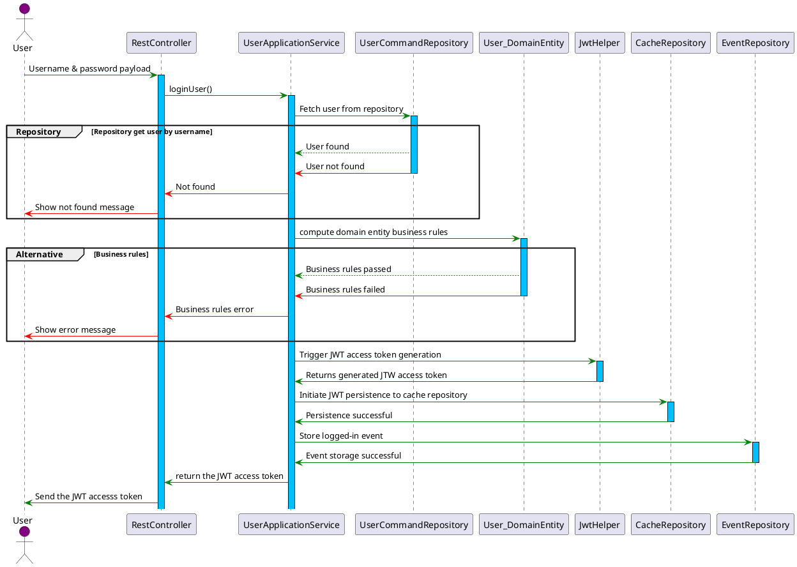
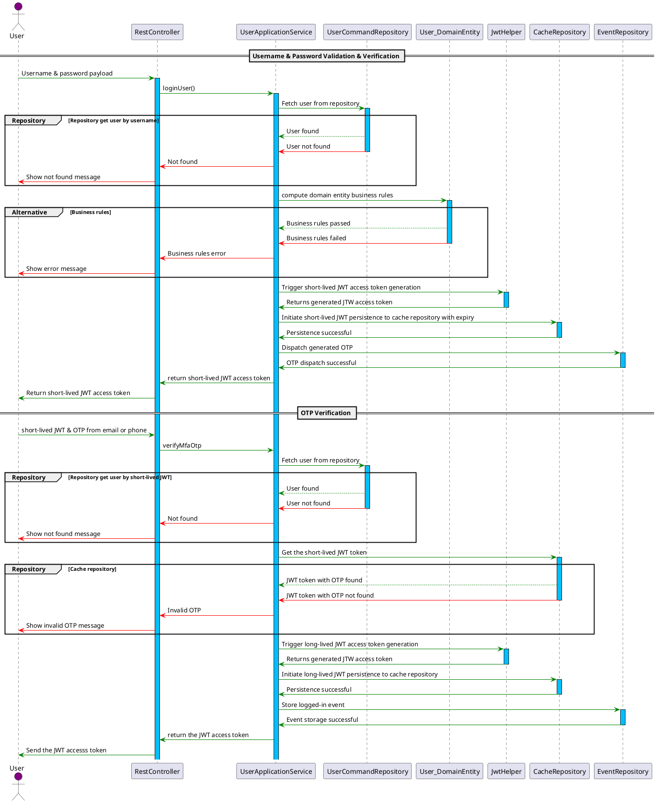
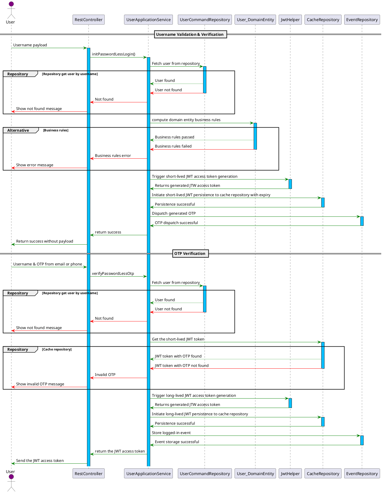
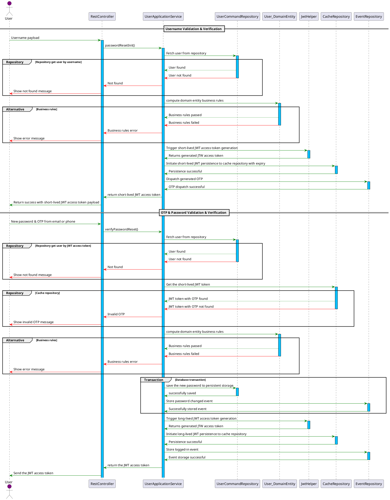
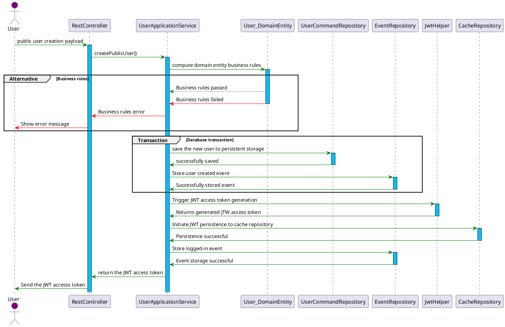

# Authentication

**Authentication** provides secure mechanisms for user login, registration, and password recovery. It supports multiple authentication flows, including multi-factor authentication (MFA) and passwordless login, ensuring a robust and flexible experience for users.

### **Purpose**

**Authentication** enables:

1. Secure user login with and without multi-factor authentication (MFA).
2. Passwordless login for enhanced convenience.
3. Public user registration with validation.
4. Password reset workflows using OTP-based verification.

---

## **Structure Authentication**

Please view the structure accessible via [Swagger UI](http://localhost:8080/swagger-ui.html).

---

## Authentication Flows

### **1. Login Without MFA**

Standard username and password authentication.

#### **Flow**

### **2. Login with MFA**

Two-step verification using an additional OTP sent via email or SMS. User can only toggle this from their profile.

1. **Username & Password**: Username and password must be valid before an OTP is sent to the user's email or phone.
2. **OTP Verification**: Verify the OTP sent to the user.

#### **Flow**

### **3. Passwordless Login**

Username-based authentication where an OTP is sent to the registered email or phone. User must have enabled this from their profile

1. **Username**: Username must be valid before an OTP is sent to the user's email or phone.
2. **OTP Verification**: Verify the OTP sent to the user.

#### **Flow**

### **4. Password Reset**

Enables users to reset forgotten passwords securely using an OTP.

#### **Flow**

### **5. Public Registration**

Allows new users to register and verify their accounts. Right groups marked as public are used to automatically assign a user

#### **Flow**

