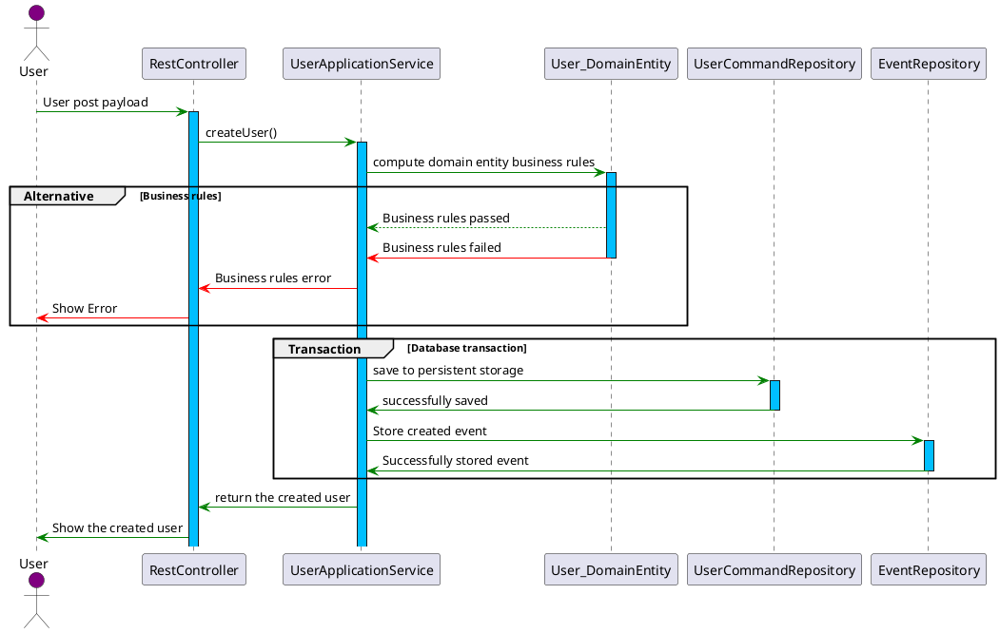
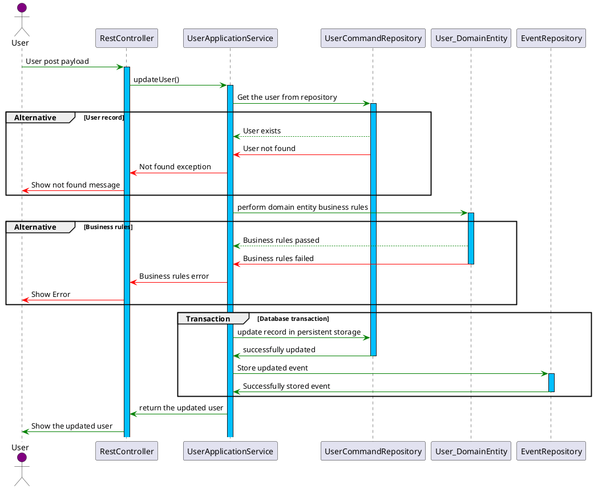
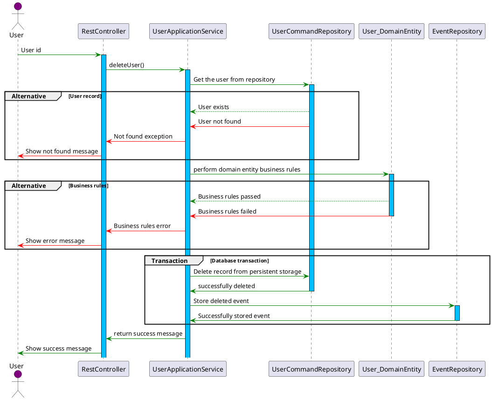

# Management

The **User Management** module is responsible for handling user lifecycle operations such as creation, retrieval, updating, and deletion. It integrates seamlessly with the **Rights Central Registry** and **right group mapping** to enforce security, rights-based access, and mapping policies.

---

## Key Concepts

### **Purpose**

The **User Management** module enables:

- Creation of users with predefined right groups.
- Retrieval of user details for administration and auditing.
- Updates to user information, including rights and group associations.
- Secure deletion or deactivation of users.

### **Rights-Based Access**

The service enforces access control through:

1. **Rights Central Registry**: Defines the available rights such as `USER_CREATE_USER`, `USER_VIEW`, `USER_UPDATE`, and `USER_DELETE`.
2. **Right Group Mapping**: Determines which **right groups** can create users and assign specific right groups.

### **Validation**

- All user-related operations must pass validation rules defined by the system.
- Mapping rules are enforced to ensure users are only added to allowed right groups.

---

## **Structure of User**

Please view the structure accessible via [Swagger UI](http://localhost:8080/swagger-ui.html).

---

## CRUD Operations

### **1. Create user**

Add a new user to the system and associate them with specific right groups.

### **2. Update user**

Update an existing user on the system and associate them with specific right groups.

### **3. Delete user**

Delete an existing user from the system.

