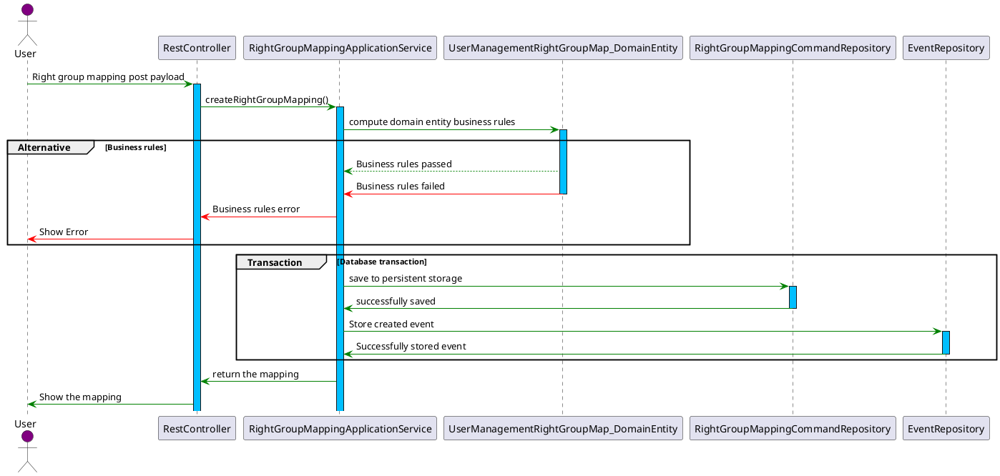
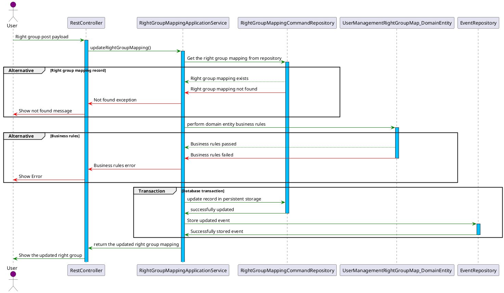
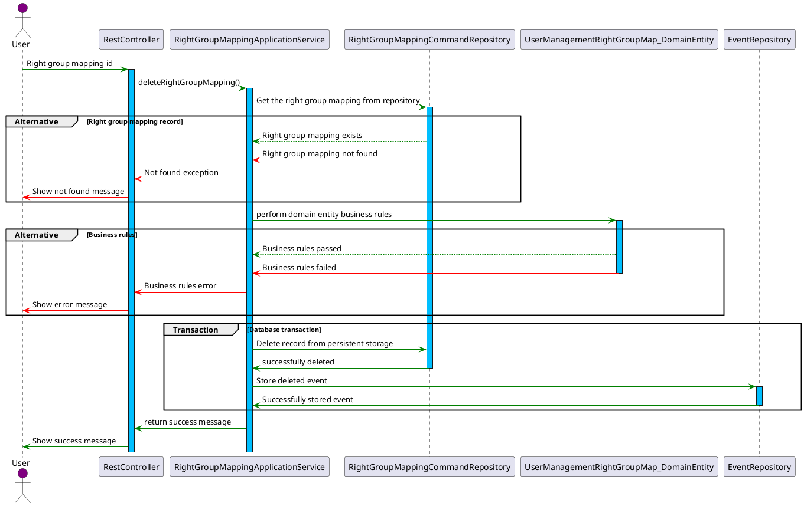

# Right Group Mapping

## **Overview**

The **right group mapping** is a crucial entity for implementing fine-grained control over which right groups can create users and assign them to specific right groups. It ensures that the creation of users adheres to strict mapping rules, promoting security and enforcing organizational policies.

## Key Concepts

### **Purpose**

The **right group mapping** determines:

- Which **right groups** are authorized to create users.
- Which **right groups** can be assigned to newly created users by a specific right group.

### **Default Behavior**

By default:

- Right groups with the `USER_CREATE_USER` right cannot create users unless explicitly mapped.
- Any create operation violating the mappings will fail.

### **Mapping Example**

An example of mapping:

- The **Admin Right Group** can create users and add them to:
  - **Farmer Right Group**
  - **Customer Care Right Group**
- The **Admin Right Group** cannot:
  - Add users to the **Donor Right Group**.
  - Add users to the **Admin Right Group** itself.

### **Enforcement**

During user creation, the system validates:

1. The creator's right group.
2. The target right group(s) specified in the request.
3. The mappings in **right group mapping**.

## **Structure of Right Groups Mapping**

Please view the structure accessible via [Swagger UI](http://localhost:8080/swagger-ui.html).

---

## CRUD Operations

### **1. Create Mapping**

Define which right group can assign users to specific right groups.

### **2. Update Mapping**

Similar to create mapping above.

### **3. Delete Mapping**

Delete mapping to prevent a user with certain right group from creating other users

