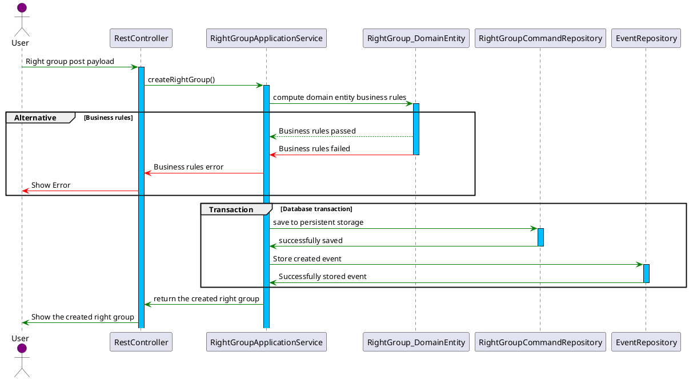
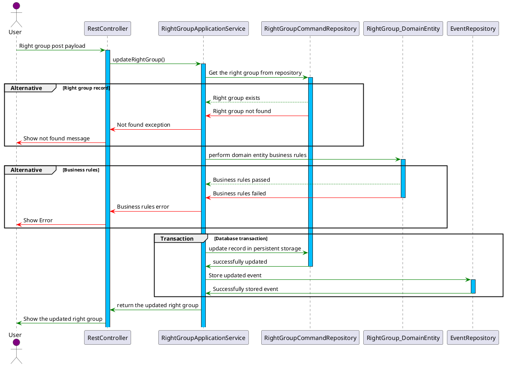
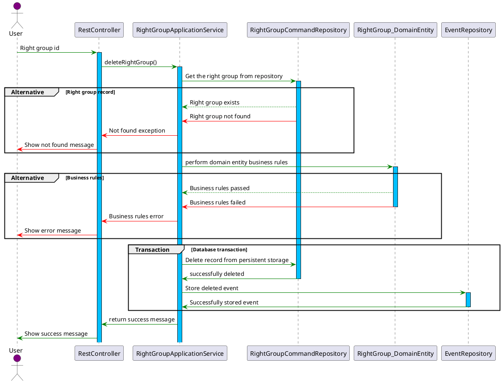

# Right Group

## **Overview**

A **Right Group** is a logical grouping of rights that defines specific permissions for users in the system. These rights are centrally managed in the **Rights Central Registry** to ensure consistency and reusability across the application. Right Groups enable streamlined permission management by associating predefined sets of rights with users or roles.

---

## **Integration with Rights Central Registry**

The **Rights Central Registry** serves as the single source of truth for all rights in the system. Right Groups interact with this registry to:

- Retrieve available rights.
- Dynamically update or create groups as new rights are added.
- Ensure consistent rights definitions across all modules.

---

## **Structure of Right Groups**

Please view the structure accessible via [Swagger UI](http://localhost:8080/swagger-ui.html).

---

## **CRUD Operations**

### **1. Create Right Group**

To create a right group, select the required rights from the registry and associate them with the group.

#### Workflow

1. Fetch available rights from the Rights Central Registry.
2. Define the group structure and selected rights.
3. Use the service layer to save the group.

#### Create right group sequence diagram

### **2. Update Right Group**

To update a right group, select the required rights from the registry and associate them with the group.

#### Workflow

1. Fetch available rights from the Rights Central Registry.
2. Define the group structure and selected rights.
3. Use the service layer to save the group.

#### Update right group sequence diagram

### **3. Delete Right Group**

To delete a right group, provide the right group id to the service layer for processing

#### Delete right group sequence diagram

